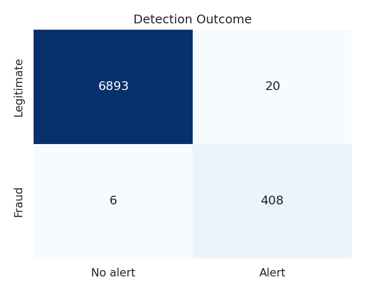
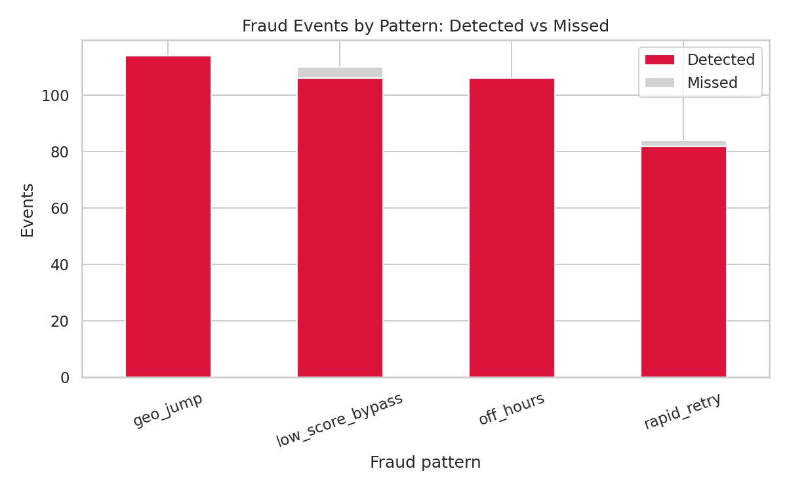
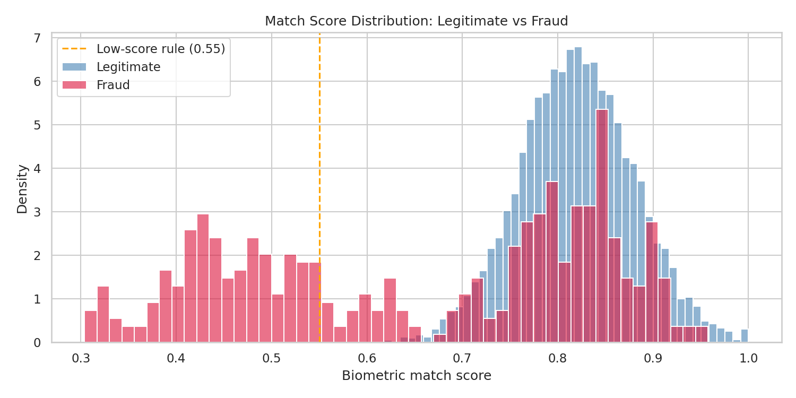

# Biometric Fraud Detection Lab

A hybrid rule-based + machine-learning pipeline that detects fraud in biometric authentication logs and produces a SOC-ready threat report.

**Final results:** 408 of 414 fraud events detected (**98.6% recall**) with 20 false positives (**95.3% precision**) across 7,327 authentication events.

> All data is synthetic, generated with known fraud patterns so detection quality can be measured. See [Limitations](#limitations).

## Architecture

```
src/generate_data.py  ->  data/raw/biometric_auth_logs.csv
          |
src/detect.py         feature engineering -> rules + Isolation Forest -> incident correlation
          |
data/processed/flagged_events.csv
          |
src/visualise.py      ->  reports/*.png
src/report.py         ->  reports/biometric_fraud_report.pdf
```

## Fraud patterns simulated

| Pattern | Description | Primary detection |
|---|---|---|
| Low-score bypass | Login accepted despite a weak biometric match | Score threshold + per-user z-score |
| Geo-jump | Login from a distant country minutes after a home login | Speed-based impossible travel |
| Rapid retry | 8-20 attempts before success (brute force / presentation attack) | Attempt-count rule |
| Off-hours | Login between 02:00 and 04:59 | Off-hours signal + Isolation Forest |

## Detection logic

- **Rules** give an explainable reason for every alert: match score < 0.55, attempts >= 8, off-hours access, per-user match-score z-score > 2.5, and impossible travel (haversine distance between consecutive logins / time elapsed > 900 km/h).
- **Isolation Forest** (scikit-learn) scores each login on match score, attempts, session length, time features, per-user score deviation and travel speed, catching combinations the rules don't encode.
- **Incident correlation**: when a fraudster logs in from abroad, the real user's next login from home also looks like impossible travel. These *return legs* are linked to the existing incident instead of raising a duplicate alert, unless they carry another suspicious signal.

## Tuning history

The first version was not usable: half of its alerts were false positives. Root-causing them drove the design.

| Version | Change | False positives | Precision | Recall |
|---|---|---|---|---|
| v1 | Naive impossible travel (any location change within 60 min) | 414 | 50.2% | 99.0% |
| v2 | Realistic baseline data (home city + coherent trips) | 31 | 93.0% | 99.3% |
| v4 | Speed-based impossible travel + return-leg correlation | 20 | 95.3% | 98.6% |

Key findings:
- 411 of v1's 414 false positives came from one rule. The root cause was unrealistic baseline behaviour, not the detector itself.
- Correlation suppressed 39 duplicate alerts, **none of which were fraud**.
- An Isolation Forest sensitivity sweep showed a sharp knee at 6%: recall collapses below it, precision collapses above it.

Full iteration history and the sensitivity sweep: [`reports/tuning_log.md`](reports/tuning_log.md)

## Results

| Detection outcome | Fraud by pattern |
|---|---|
|  |  |



The generated [PDF threat report](reports/biometric_fraud_report.pdf) includes an executive summary, pattern breakdown, temporal analysis, a ranked investigation queue and recommendations with quantified impact. For example, step-up verification below a 0.65 match score would challenge 47.1% of fraudulent logins while affecting only 0.3% of legitimate ones.

A guided walkthrough is in [`notebooks/analysis.ipynb`](notebooks/analysis.ipynb).

## Reproduce

```bash
git clone https://github.com/SaiNithishS/biometric-fraud-lab.git
cd biometric-fraud-lab
pip install -r requirements.txt
bash run_pipeline.sh
```

All randomness is seeded, so the pipeline reproduces the results above exactly. Runs on Python 3.10+ locally or in Google Colab.

## Project structure

```
biometric-fraud-lab/
├── src/
│   ├── generate_data.py   # synthetic logs with injected fraud
│   ├── detect.py          # features, rules, Isolation Forest, correlation, evaluation
│   ├── visualise.py       # charts
│   └── report.py          # PDF threat report
├── notebooks/analysis.ipynb
├── reports/               # charts, PDF report, tuning log
├── data/                  # generated by the pipeline (git-ignored)
├── run_pipeline.sh
└── requirements.txt
```

## Limitations

- Synthetic data is cleaner than real traffic. For example, no legitimate user logs in off-hours here, which makes that pattern unrealistically easy to detect.
- The 6% Isolation Forest sensitivity is close to the dataset's true fraud rate, which a production system would not know. In practice it would be tuned against analyst feedback on closed alerts.
- Location is city-level; real impossible-travel detection must also handle VPNs, proxies and IP geolocation error.

## What I'd do next

- **Port the rules to KQL** as Microsoft Sentinel analytics rules, with the Isolation Forest score ingested as a custom log.
- **Streaming ingestion** (e.g. Kafka) to score logins in near real time instead of in batch.
- **Analyst feedback loop**: use closed-alert dispositions to retune thresholds and model sensitivity.
- **Richer baselines**: per-user device and location history ("first time seen" signals), and SHAP explanations for model-only alerts.
